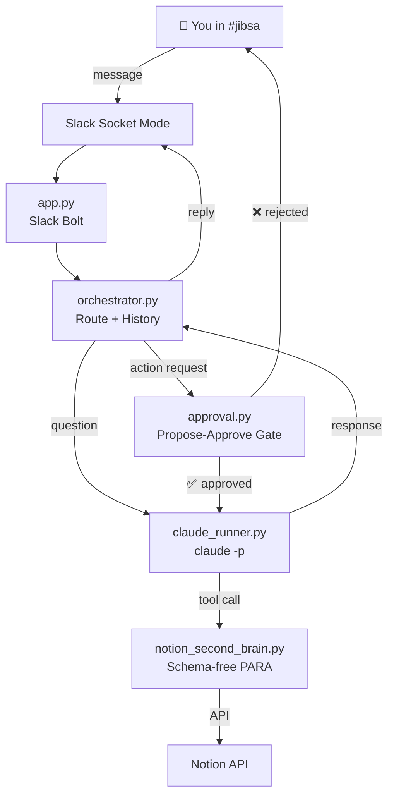

<p align="center">
  
</p>

<h1 align="center">집사 · Jibsa</h1>

<p align="center">
  <strong>Your AI Steward</strong> — an open-source AI secretary that lives in your Slack workspace.
</p>

<p align="center">
  <a href="LICENSE"></a>
  <a href="https://www.python.org/downloads/"></a>
  <a href="https://anthropic.com"></a>
  <a href="https://github.com/astral-sh/uv"></a>
</p>

---

Jibsa (집사, Korean for "steward") acts as your personal AI secretary — managing tasks, organizing your Notion Second Brain, and handling day-to-day workflows, all from a single `#jibsa` Slack channel.

Built on [Claude](https://claude.ai) via the `claude -p` headless CLI. All write operations go through a **propose-approve** gate — Jibsa never acts without your explicit approval.

## Workflow

```
You:  "Create a task to review Q1 budget by Friday"
                        │
                ┌───────▼────────┐
                │  🤔 Jibsa      │  analyses your request
                └───────┬────────┘
                        │
                ┌───────▼────────┐
                │  📋 Propose    │  drafts a plan and posts it in the thread
                └───────┬────────┘
                        │  ← you reply ✅ to approve or ❌ to revise
                ┌───────▼────────┐
                │  ⚡ Execute    │  creates the task in Notion
                └───────┬────────┘
                        │
                ✅ Jibsa confirms completion
```

### Approval keywords

| Approve | Reject / Revise |
|---------|-----------------|
| `✅`, `yes`, `approved`, `go`, `go ahead`, `do it`, `proceed` | `❌`, `no`, `cancel`, `stop`, `revise`, `change` |

## Features

| Integration | Capabilities | Status |
|-------------|-------------|--------|
| **Slack** | Socket Mode bot, threaded conversations, propose-approve flow | ✅ Live |
| **Notion** | Schema-free PARA Second Brain — tasks, projects, notes, journals, expenses, workouts, and more (26 databases) | ✅ Live |
| **Jira** | Ticket sync, morning briefing, EOD review, overdue alerts | 🔜 Phase 3 |
| **Google Calendar** | Event management, scheduled reminders | 🔜 Phase 3 |
| **Gmail** | Email triage, weekly digest | 🔜 Phase 4 |

### Notion Second Brain

Jibsa connects to your Notion workspace with a **schema-free** architecture — no hardcoded property names or database structures. Add any database by editing `config/notion_databases.yaml`:

```yaml
- name: Tasks
  id: abc123...
  keywords: [task, todo, action]
```

**Available actions:** `create_task`, `update_task_status`, `create_project`, `create_note`, `create_journal_entry`, `log_expense`, `log_workout`

Reads use page flattening (any page to key-value JSON). Writes auto-discover property schemas at runtime.

---

## Quick Start

```bash
# 1. Clone
git clone https://github.com/peterjhwang/jibsa-ai.git
cd jibsa-ai

# 2. Create venv and install dependencies
uv venv
source .venv/bin/activate
uv pip install -r requirements.txt

# 3. Configure
cp .env.example .env
# Edit .env with your Slack and Notion tokens

cp config/notion_databases.yaml.example config/notion_databases.yaml
# Edit with your Notion database IDs

# 4. Run
python -m src.app

# 5. Talk to Jibsa
# Go to #jibsa in Slack and say hello
```

### With Docker

```bash
cp .env.example .env
# Edit .env with your tokens

docker-compose up -d
```

---

## Documentation

- **[Slack App Setup](docs/slack-setup.md)** — Create and configure the Slack app
- **[Notion Setup](docs/notion-setup.md)** — Connect your Notion Second Brain

---

## Configuration

All behaviour is controlled via YAML files in `config/`:

| File | Purpose |
|------|---------|
| `settings.yaml` | Channel, timezone, schedules, approval keywords |
| `persona.yaml` | Jibsa's name, tone, and personality |
| `notion_databases.yaml` | Notion database IDs and keyword routing |
| `prompts/system.txt` | Claude system prompt template |

Secrets go in `.env` (never committed).

---

## Project Structure

```
jibsa-ai/
├── src/
│   ├── app.py                  # Slack Bolt entry point (Socket Mode)
│   ├── orchestrator.py         # Routes messages, manages approve flow, history
│   ├── claude_runner.py        # Wraps `claude -p` subprocess
│   ├── approval.py             # ApprovalState machine per Slack thread
│   └── integrations/
│       ├── notion_client.py    # Thin Notion SDK wrapper
│       └── notion_second_brain.py  # Schema-free PARA operations
│
├── config/
│   ├── settings.yaml           # Channel, timezone, schedules
│   ├── persona.yaml            # Jibsa's personality
│   ├── notion_databases.yaml   # Notion DB mappings (gitignored)
│   └── prompts/
│       └── system.txt          # Claude system prompt template
│
├── tests/                      # pytest test suite (55 passing)
├── docs/                       # Setup guides
├── assets/                     # Logo and images
├── Dockerfile
├── docker-compose.yml
└── .env.example
```

---

## Architecture



---

## Key Design Decisions

| Decision | Choice | Rationale |
|----------|--------|-----------|
| LLM interface | `claude -p` CLI | Uses Claude Max quota, no API key cost |
| Slack transport | Socket Mode | No public URL or reverse proxy needed |
| Approval gate | Propose-approve in thread | Jibsa never writes to external systems without explicit approval |
| Notion reads | Page flattening | Any page → flat key-value JSON, passed raw to Claude |
| Notion writes | Runtime schema discovery | Auto-detect property types, no hardcoded schemas |
| Database routing | Keyword matching | Config-driven — add any database without code changes |
| State management | Per-thread conversation history | Maintained in orchestrator, capped at 20 message pairs |

---

## Requirements

- Python 3.12+
- [uv](https://github.com/astral-sh/uv) (recommended) or pip
- A [Slack app](https://api.slack.com/apps) with Socket Mode enabled
- Claude CLI authenticated (`claude` in PATH, Max plan)
- Notion integration token (for Second Brain features)

---

## Roadmap

| Phase | Scope | Status |
|-------|-------|--------|
| **1** | Core loop: Slack bot + Claude + propose-approve flow | ✅ Done |
| **2** | Notion Second Brain (PARA: 26 databases, schema-free) | ✅ Done |
| **3** | Jira + Google Calendar + scheduled jobs (morning briefing, EOD review) | 🔜 |
| **4** | Gmail + weekly digest + team interactions | 🔜 |
| **5** | Setup wizard, Slack Block Kit, audit logging, open-source polish | 🔜 |

## License

[MIT](LICENSE)
