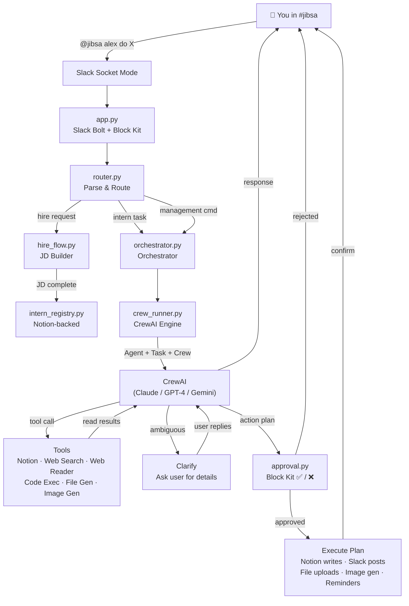

<p align="center">
  
</p>

<h1 align="center">집사 · Jibsa</h1>

<p align="center">
  <strong>Your AI Intern Platform</strong> — create custom AI interns with job descriptions, tools, and approval rules, all inside Slack.
</p>

<p align="center">
  <a href="LICENSE"></a>
  <a href="https://www.python.org/downloads/"></a>
  <a href="https://www.crewai.com"></a>
  <a href="https://github.com/astral-sh/uv"></a>
</p>

---

Jibsa (집사, Korean for "steward") is an open-source multi-AI-intern platform that lives in your Slack workspace. Create custom AI interns — each with their own job description, personality, tools, and approval rules — and delegate tasks via `@jibsa`.

Built on [CrewAI](https://www.crewai.com) with multi-provider LLM support (Claude, GPT-4, Gemini). All write operations go through a **propose-approve** gate with interactive Block Kit buttons — interns never act without your explicit approval.

## How It Works

```
You:  "@jibsa alex write 3 LinkedIn posts about our product launch"
                        │
                ┌───────▼────────┐
                │  🔀 Router     │  routes to Alex (content intern)
                └───────┬────────┘
                        │
                ┌───────▼────────┐
                │  🤖 CrewAI     │  Alex reasons with assigned tools
                └───────┬────────┘  (web search, Notion, etc.)
                        │
                ┌───────▼────────┐
                │  🤔 Clarify?   │  if ambiguous → asks a question first
                └───────┬────────┘  (you reply, conversation continues)
                        │
                ┌───────▼────────┐
                │  📋 Propose    │  posts plan with ✅/❌ buttons
                └───────┬────────┘
                        │  ← you click ✅ Approve
                ┌───────▼────────┐
                │  ⚡ Execute    │  creates tasks in Notion, posts to Slack
                └───────┬────────┘
                        │
                ✅ [Alex — Content Intern] confirms completion
```

### Commands (all via `@jibsa` mention)

| Command | What it does |
|---------|-------------|
| `@jibsa hire a marketing intern` | Start conversational hiring flow |
| `@jibsa alex write 3 blog posts` | Delegate a task to intern Alex |
| `@jibsa ask mia to research competitors` | Alternative routing syntax |
| `@jibsa alex, mia research and write a report` | Multi-intern team collaboration |
| `@jibsa list interns` or `@jibsa team` | Show all active interns (Block Kit cards) |
| `@jibsa show alex's jd` | View an intern's Job Description (rich Block Kit) |
| `@jibsa edit alex's jd` | Interactive JD editing session |
| `@jibsa fire alex` | Deactivate an intern |
| `@jibsa help` | Contextual help with all commands |
| `@jibsa help alex` | Intern-specific help (role, tools, usage) |
| `@jibsa stats` | Usage metrics dashboard with recent actions |
| `@jibsa history` | Approval history (approved/rejected plans) |
| `@jibsa reminders` | List pending scheduled reminders |

### Approval

Plans can be approved via **Block Kit buttons** (✅ Approve / ❌ Reject) or text replies:

| Approve | Reject / Revise |
|---------|-----------------|
| `✅`, `yes`, `approved`, `go`, `go ahead`, `do it`, `proceed` | `❌`, `no`, `cancel`, `stop`, `revise`, `change` |

## Features

### Multi-Intern System
- **Conversational hiring** — describe what you need, Jibsa helps you write a complete Job Description
- **Ambiguity detection** — interns ask clarifying questions when a request is vague or missing critical details before proposing an action
- **JD validation** — enforces name, role, responsibilities, tool assignments
- **Interactive JD editing** — `edit alex's jd` starts a session to modify any field via natural language or direct commands
- **Per-intern tools** — each intern only sees their assigned tools
- **Channel-scoped memory** — interns remember past interactions, isolated per Slack channel (capped at 20 entries each)
- **Smart routing** — `@jibsa alex do X`, `@jibsa ask alex to X`, name prefix, etc.
- **Team collaboration** — `@jibsa alex, mia do X` spins up a multi-agent CrewAI crew

### Reliability & Observability
- **Health check CLI** — `python -m src.doctor` validates config, env vars, Slack/Notion/LLM connectivity, and dependencies
- **Config validation** — Pydantic-validated `settings.yaml` catches typos at startup
- **Circuit breaker** — Notion API calls use a three-state circuit breaker (CLOSED → OPEN → HALF_OPEN) to prevent cascading failures
- **Request tracing** — every request gets a UUID, latency is logged
- **Usage metrics** — `@jibsa stats` shows per-intern request counts, latencies, approval rates, and errors
- **Approval history** — `@jibsa history` shows recent approved/rejected plans with timestamps
- **Scheduled activity digest** — configurable weekly summary posted to your Jibsa channel
- **Thinking indicator** — posts a "Thinking..." message while CrewAI reasons, then removes it
- **Approval TTL** — pending plans auto-expire after a configurable timeout (default 1 hour)
- **Crew timeout** — configurable `SIGALRM`-based timeout for CrewAI executions (default 5 min)

### Rich Slack UI (Block Kit)
- **Intern cards** — `list interns` shows per-intern cards with tools, responsibilities preview, and "View JD" buttons
- **JD display** — `show alex's jd` renders structured sections with fields, memory stats, and action hints
- **Stats dashboard** — `stats` shows metrics with recent actions timeline
- **Contextual help** — `help` provides grouped command reference; `help alex` shows intern-specific usage

### Tools

| Tool | Type | Description |
|------|------|-------------|
| **Notion** | Read + Write | Query and manage tasks, projects, notes, journals, expenses, workouts (26 databases) |
| **Web Search** | Read-only | DuckDuckGo search — no API key required |
| **Web Reader** | Read-only | Fetch and read full web pages via [ZenRows](https://www.zenrows.com) (JS rendering, anti-bot) |
| **Code Exec** | Read-only | Sandboxed Python execution for calculations and data processing |
| **File Generator** | Write (approval) | Generate CSV, JSON, Markdown, or text files and upload to Slack |
| **Image Generator** | Write (approval) | Generate AI images via Nano Banana 2 (Gemini) and upload to Slack |
| **Reminder** | Write (approval) | Schedule timed reminders via APScheduler — posts to Slack at the specified time |
| **Slack** | Write (approval) | Post messages to Slack channels |
| **Calendar** | Read-only (stub) | Google Calendar integration — coming in Phase 3 |

### Integrations

| Integration | Status |
|-------------|--------|
| **Slack** — Socket Mode bot, threaded conversations, Block Kit buttons | ✅ Live |
| **Notion** — Schema-free PARA Second Brain (26 databases) | ✅ Live |
| **CrewAI** — Multi-provider LLM orchestration (Claude, GPT-4, Gemini) | ✅ Live |
| **ZenRows** — Web page fetching with JS rendering and anti-bot bypass | ✅ Live |
| **Nano Banana 2** — AI image generation via Google Gemini | ✅ Live |
| **APScheduler** — Background scheduler for timed reminders | ✅ Live |
| **Jira** — Ticket sync, morning briefing, overdue alerts | 🔜 Phase 3 |
| **Google Calendar** — Event management, scheduled reminders | 🔜 Phase 3 |
| **Gmail** — Email triage, weekly digest | 🔜 Phase 4 |

### Notion Second Brain

Jibsa connects to your Notion workspace with a **schema-free** architecture — no hardcoded property names or database structures. Add any database by editing `config/notion_databases.yaml`:

```yaml
- name: Tasks
  id: abc123...
  keywords: [task, todo, action]
```

**Available actions:** `create_task`, `update_task_status`, `create_project`, `create_note`, `create_journal_entry`, `log_expense`, `log_workout`

Reads use page flattening (any page to key-value JSON). Writes auto-discover property schemas at runtime.

---

## Quick Start

```bash
# 1. Clone
git clone https://github.com/peterjhwang/jibsa-ai.git
cd jibsa-ai

# 2. Create venv and install dependencies
uv venv
source .venv/bin/activate
uv pip install -r requirements.txt

# 3. Configure
cp .env.example .env
# Edit .env with your Slack tokens and Notion token

cp config/notion_databases.yaml.example config/notion_databases.yaml
# Edit with your Notion database IDs

# 4. Verify setup
python -m src.doctor
# Checks config, env vars, Slack/Notion/LLM connectivity

# 5. Run
python -m src.app

# 6. Talk to Jibsa
# Go to #jibsa in Slack and say: "help" or "hire a content marketing intern"
```

### With Docker

```bash
cp .env.example .env
# Edit .env with your tokens

docker-compose up -d
```

---

## Documentation

- **[Slack App Setup](docs/slack-setup.md)** — Create and configure the Slack app
- **[Notion Setup](docs/notion-setup.md)** — Connect your Notion Second Brain
- **[Feature Roadmap](docs/feature-impact-effort.md)** — Planned features with impact/effort analysis
- **[Platform Enhancements](docs/feature-platform-enhancements.md)** — JD templates, doctor CLI, multi-model failover
- **[Contributing](CONTRIBUTING.md)** — Development setup, testing, architecture

---

## Configuration

All behaviour is controlled via YAML files in `config/`:

| File | Purpose |
|------|---------|
| `settings.yaml` | LLM provider, channel, timezone, approval keywords, integrations |
| `persona.yaml` | Jibsa's name, tone, and personality |
| `notion_databases.yaml` | Notion database IDs and keyword routing (gitignored) |
| `prompts/system.txt` | Jibsa orchestrator system prompt |
| `prompts/intern.txt` | Intern-specific system prompt template |
| `prompts/hire.txt` | Hiring flow system prompt |

### LLM Configuration

Jibsa uses CrewAI with multi-provider support. Configure in `config/settings.yaml`:

```yaml
llm:
  provider: "anthropic"          # "anthropic", "openai", or "google"
  model: "claude-sonnet-4-20250514"
  temperature: 0.7
  max_tokens: 4096
```

Set the corresponding API key in `.env`:
- Anthropic: `ANTHROPIC_API_KEY`
- OpenAI: `OPENAI_API_KEY`
- Google: `GOOGLE_API_KEY`

Secrets go in `.env` (never committed).

---

## Project Structure

```
jibsa-ai/
├── src/
│   ├── app.py                  # Slack Bolt entry point (Socket Mode + Block Kit actions)
│   ├── orchestrator.py         # Central router: messages → interns → CrewAI → approval
│   ├── crew_runner.py          # CrewAI Agent/Task/Crew builder (primary engine)
│   ├── router.py               # Message parsing, intern routing, team detection
│   ├── hire_flow.py            # Conversational JD creation flow
│   ├── intern_registry.py      # CRUD for interns (Notion-backed, cached)
│   ├── tool_registry.py        # Tool catalog + per-intern permission checking
│   ├── approval.py             # ApprovalState machine per Slack thread (with TTL)
│   ├── config_schema.py        # Pydantic validation for settings.yaml
│   ├── doctor.py               # Health check CLI (python -m src.doctor)
│   ├── circuit_breaker.py      # Three-state circuit breaker for API resilience
│   ├── metrics.py              # In-memory request tracking and stats
│   ├── scheduler.py            # APScheduler wrapper for timed reminders
│   ├── models/
│   │   └── intern.py           # InternJD dataclass (validation, channel-scoped memory)
│   ├── tools/
│   │   ├── notion_read_tool.py # CrewAI BaseTool: Notion queries
│   │   ├── web_search_tool.py  # CrewAI BaseTool: DuckDuckGo search
│   │   ├── web_reader_tool.py  # CrewAI BaseTool: ZenRows page fetcher
│   │   ├── code_exec_tool.py   # CrewAI BaseTool: sandboxed Python
│   │   ├── file_gen_tool.py    # CrewAI BaseTool: CSV/JSON/MD/TXT generator
│   │   ├── image_gen_tool.py   # CrewAI BaseTool: Nano Banana 2 image generation
│   │   ├── reminder_tool.py    # CrewAI BaseTool: scheduled reminders
│   │   ├── slack_tool.py       # CrewAI BaseTool: Slack post (write, needs approval)
│   │   └── calendar_tool.py    # CrewAI BaseTool: Calendar stub (Phase 3)
│   └── integrations/
│       ├── notion_client.py    # Thin Notion SDK wrapper
│       └── notion_second_brain.py  # Schema-free PARA operations
│
├── config/
│   ├── settings.yaml           # LLM, channel, timezone, approval, integrations
│   ├── persona.yaml            # Jibsa's personality
│   ├── notion_databases.yaml   # Notion DB mappings (gitignored)
│   └── prompts/
│       ├── system.txt          # Jibsa orchestrator prompt
│       ├── intern.txt          # Intern system prompt template
│       └── hire.txt            # Hire flow prompt
│
├── tests/                      # pytest test suite (293 passing)
├── docs/                       # Setup guides
├── assets/                     # Logo and images
├── Dockerfile
├── docker-compose.yml
└── .env.example
```

---

## Architecture



---

## Key Design Decisions

| Decision | Choice | Rationale |
|----------|--------|-----------|
| Orchestration | CrewAI | Native multi-provider LLM, Agent/Task/Crew model, built-in tool use, ambiguity detection |
| LLM support | Multi-provider | `anthropic/claude`, `openai/gpt-4o`, `google/gemini` via CrewAI |
| Slack transport | Socket Mode | No public URL or reverse proxy needed |
| Approval gate | Block Kit buttons + text | Interactive ✅/❌ buttons with text fallback, auto-expiring TTL |
| Tool isolation | Per-intern filtering | Each intern only accesses tools listed in their JD |
| Config validation | Pydantic | Catches typos and invalid values at startup, not runtime |
| API resilience | Circuit breaker | Prevents cascading failures from flaky external APIs |
| Notion reads | Page flattening | Any page → flat key-value JSON, passed raw to LLM |
| Notion writes | Runtime schema discovery | Auto-detect property types, no hardcoded schemas |
| Intern storage | Notion database | JDs stored in Notion Interns DB with caching |
| Database routing | Keyword matching | Config-driven — add any Notion database without code changes |

---

## Testing

```bash
# Run all tests
.venv/bin/python -m pytest tests/ -v

# Run a specific test file
.venv/bin/python -m pytest tests/test_orchestrator.py -v

# Run with coverage
.venv/bin/python -m pytest tests/ --cov=src --cov-report=term-missing
```

293 tests covering: routing, approval, CrewAI runner, hire flow, intern model, tool registry, all 9 tools, orchestrator (help, edit, history, Block Kit), Notion second brain, circuit breaker, metrics, scheduler, doctor CLI.

---

## Requirements

- Python 3.12+
- [uv](https://github.com/astral-sh/uv) (recommended) or pip
- A [Slack app](https://api.slack.com/apps) with Socket Mode + Interactivity enabled
- LLM API key (Anthropic, OpenAI, or Google — depending on `settings.yaml` config)
- Notion integration token (for Second Brain + intern storage)
- **Optional:** `ZENROWS_API_KEY` for the Web Reader tool
- **Optional:** `GOOGLE_API_KEY` for Nano Banana 2 image generation (also used if your LLM provider is Google)

---

## Roadmap

| Phase | Scope | Status |
|-------|-------|--------|
| **1** | Core loop: Slack bot + Claude + propose-approve flow | ✅ Done |
| **2** | Notion Second Brain (PARA: 26 databases, schema-free) | ✅ Done |
| **2.5** | Multi-intern platform: CrewAI, hiring flow, 5 tools, Block Kit | ✅ Done |
| **2.6** | Reliability (config validation, circuit breaker, metrics, approval TTL) | ✅ Done |
| **2.7** | New tools: Web Reader, File Gen, Image Gen, Reminders + team collaboration | ✅ Done |
| **2.8** | UX: help, edit JD, history, Block Kit, doctor CLI, activity digest | ✅ Done |
| **3** | Jira + Google Calendar + scheduled jobs (morning briefing, EOD review) | 🔜 |
| **4** | Gmail + weekly digest | 🔜 |
| **5** | Setup wizard, audit logging, open-source polish | 🔜 |

## License

[MIT](LICENSE)
